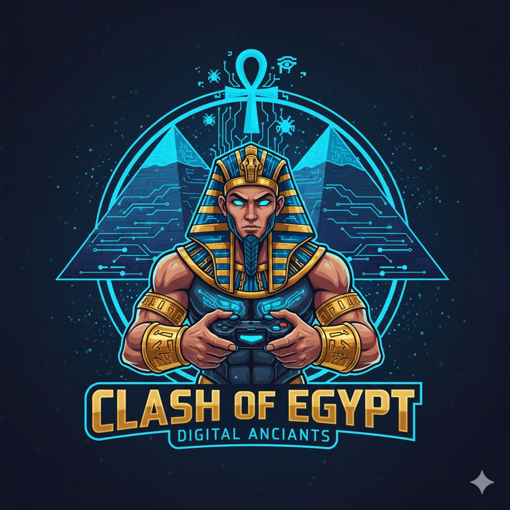

# 🎮 Clash of Egypt

<div align="center">



### ⚡ Egypt’s Premier Gaming & Esports Arena ⚡

**Enter the Game. Be the Champion.**

</div>

---

## 🚀 Overview

**Clash of Egypt** is a futuristic gaming & esports arena website designed to deliver a premium digital experience inspired by competitive gaming culture, cyberpunk aesthetics, and next-generation entertainment.

The project features a fully responsive single-page experience with:

- ⚡ Smooth animations
- 🎮 Gaming-focused UI/UX
- 🥽 VR & esports sections
- 🏆 Tournament showcase
- 📱 Mobile-first responsiveness
- 🌌 Immersive neon cyberpunk design

Built using pure **HTML, CSS, and JavaScript** without frameworks for maximum performance and flexibility.

---

# ✨ Features

## 🎨 Modern UI/UX

- Cyberpunk inspired design
- Neon glow effects
- Interactive hover animations
- Smooth page transitions
- Glassmorphism cards
- Responsive layouts

---

## 📱 Fully Responsive

- Mobile optimized
- Tablet friendly
- Ultra-wide screen support
- Adaptive typography
- Responsive navigation menu

---

## 🎮 Gaming Experience

- Hero landing section
- Tournament showcase
- Gaming services pages
- VR experience section
- Interactive gallery
- Booking system UI

---

## ⚙️ Technical Features

- SPA-like navigation
- Custom animations
- Dynamic modals
- Smooth scrolling
- Interactive particles background
- Performance optimized

---

# 🛠️ Tech Stack

<p align="center">


</p>

| Technology | Usage |
|------------|--------|
| HTML5 | Structure |
| CSS3 | Styling & Animations |
| JavaScript | Interactivity |
| Google Fonts | Typography |
| Responsive Design | Mobile Compatibility |

---

# 📂 Project Structure

```bash
Clash-Of-Egypt/
│
├── index.html
├── Logo.jpeg
├── Background Pic.jpeg
└── README.md
```

---

# 🌟 Website Sections

- 🏠 Home
- ⚡ About
- 🎮 Services
- 🏆 Tournaments
- 🖼️ Gallery
- 📍 Contact
- 📅 Booking Modal

---

# 💡 Design Highlights

## 🎨 Color Palette

| Color | Hex |
|-------|------|
| Electric Blue | `#00D4FF` |
| Neon Purple | `#8B5CF6` |
| Cyber Violet | `#C026D3` |
| Dark Navy | `#03040D` |

---

## ✨ Effects Used

- Neon glows
- Animated particles
- Floating orbs
- Hover transitions
- Blur glass effects
- Scroll reveal animations

---

# ⚡ Getting Started

## 1️⃣ Clone the Repository

```bash
git clone https://github.com/yourusername/clash-of-egypt.git
```

---

## 2️⃣ Open the Project

Simply open:

```bash
index.html
```

in your browser.

---

# 🔥 Future Improvements

- Backend integration
- Real booking system
- Authentication system
- Live tournaments API
- Payment gateway
- Real-time leaderboard
- Multi-language support
- Admin dashboard

---

# 👨‍💻 Author

## Mohamed Adnan

Passionate about:

- 🎮 Gaming Experiences
- 🎨 UI/UX Design
- 💻 Frontend Development
- 🏆 Esports Platforms
- 🚗 Automotive Tech & AI

---

# 🏆 Vision

Clash of Egypt aims to become the ultimate esports and gaming destination in Egypt’s New Administrative Capital — combining competitive gaming, immersive experiences, and futuristic entertainment into one iconic digital brand.

---

# 📜 License

This project is licensed for personal and educational use.

---

<div align="center">

## ⚡ CLASH OF EGYPT ⚡

### *Enter the Game. Be the Champion.*

⭐ Don't forget to star the repository!

</div>
